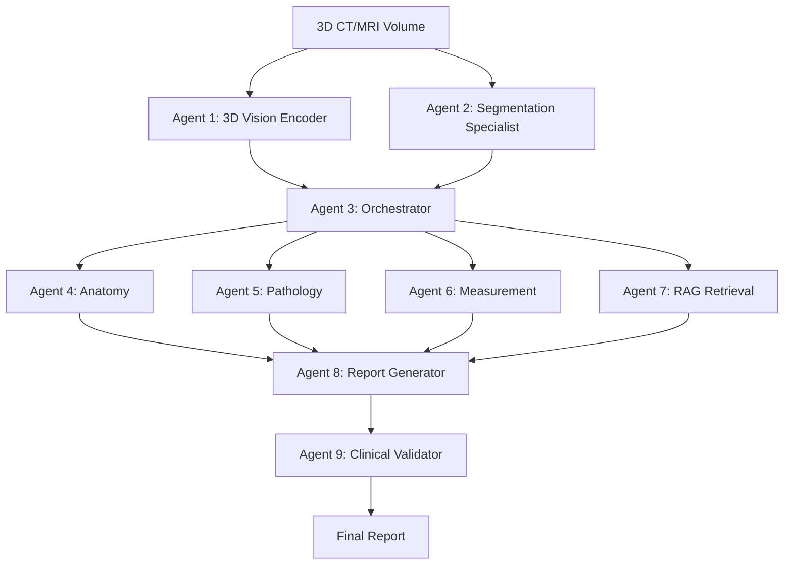

# 🚀 Agentic Multi-Modal Foundation System (Medical_reporting_agent)

**Hệ Thống Tiên Tiến Tạo Báo Cáo Y Tế Tự Động từ Dữ Liệu CT/MRI 3D Đạt Chuẩn SOTA**

Dự án này triển khai một kiến trúc **Agentic AI** (Trí tuệ nhân tạo tác tử) thế hệ mới, được thiết kế để vượt qua các giới hạn của các mô hình monolithic truyền thống. Medical_reporting_agent kết hợp sức mạnh của 3 xu hướng đột phá nhất năm 2024-2025: **Agentic Architecture**, **3D Vision-Language Modeling**, và **Segmentation-Guided Analysis**.

---

## 🏗 Kiến Trúc Hệ Thống (System Architecture)

Hệ thống hoạt động dựa trên sự phối hợp của **9 Agents chuyên biệt**, được điều phối bởi một "bộ não" trung tâm.

### 🧩 Sơ đồ khối


---

## 🤖 Chi Tiết Các Agents (9 Agents)

Hệ thống được module hóa thành các thành phần độc lập, dễ dàng nâng cấp và bảo trì:

### **1. Agent 1: 3D Vision Encoder (Global Understanding)**
*   **Nhiệm vụ:** Trích xuất đặc trưng hình ảnh toàn cục (global visual features) từ dữ liệu khối (volumetric data).
*   **Công nghệ:** Sử dụng kiến trúc **Swin Transformer 3D** (tương tự RadFM/M3D-LaMed) để hiểu ngữ cảnh không gian 3 chiều.
*   **Output:** Vector đặc trưng (embeddings) cho từng vùng không gian.

### **2. Agent 2: Segmentation Specialist (Local Precision)**
*   **Nhiệm vụ:** Phân đoạn chính xác các cơ quan và tổn thương (organs & lesions).
*   **Công nghệ:** **nnU-Net V2** kết hợp với **SAM-Med3D** để tinh chỉnh vùng biên (boundaries).
*   **Lợi ích:** Cung cấp thông tin định lượng chính xác (kích thước, vị trí) mà các mô hình ngôn ngữ thường gặp khó khăn.

### **3. Agent 3: Knowledge Fusion & Orchestrator ("The Brain")**
*   **Nhiệm vụ:** Lập kế hoạch (Planning) và Điều phối (Routing). Dựa trên input, nó quyết định cần gọi những chuyên gia nào.
*   **Công nghệ:** **LLM-based Planner** (ví dụ: GPT-4o hoặc Claude 3.5 Sonnet).
*   **Ví dụ:** Nếu phát hiện nodule ở phổi, nó sẽ gọi Agent Pathology và Measurement; nếu input bình thường, nó có thể bỏ qua các bước sâu.

### **4. Agent 4: Anatomy Specialist**
*   **Nhiệm vụ:** Xác định chính xác vị trí giải phẫu (ví dụ: "Thùy trên phổi phải, phân thùy sau").
*   **Công nghệ:** Fine-tuned BiomedCLIP kết hợp với Knowledge Graph giải phẫu.

### **5. Agent 5: Pathology Specialist**
*   **Nhiệm vụ:** Phân loại tổn thương (ví dụ: Nodule vs Mass, Benign vs Malignant), mô tả tính chất (spiculated, ground-glass).
*   **Công nghệ:** Classifier chuyên biệt huấn luyện trên tập dữ liệu RadImageNet.

### **6. Agent 6: Measurement Quantifier**
*   **Nhiệm vụ:** Tính toán kích thước, thể tích, tỷ trọng (HU) một cách tất định (deterministic).
*   **Công nghệ:** Thuật toán hình học dựa trên mask phân đoạn (Mask-based calculation), đảm bảo độ chính xác tuyệt đối so với việc dùng AI để đoán số.

### **7. Agent 7: RAG Retrieval Specialist**
*   **Nhiệm vụ:** Tìm kiếm các hướng dẫn lâm sàng (guidelines) và các ca bệnh tương tự (similar cases).
*   **Công nghệ:** Vector Database (ChromaDB) chứa các guideline (ví dụ: Fleischner Society guidelines) và cơ sở dữ liệu ca bệnh đã chẩn đoán.

### **8. Agent 8: Report Generator**
*   **Nhiệm vụ:** Tổng hợp tất cả thông tin từ các agents trên để viết báo cáo hoàn chỉnh.
*   **Công nghệ:** **MedGemma-2B** được tinh chỉnh (Fine-tuned) với kỹ thuật **LoRA** trên dữ liệu báo cáo chất lượng cao.

### **9. Agent 9: Clinical Validator**
*   **Nhiệm vụ:** Kiểm tra chất lượng (Quality Control). Đối chiếu nội dung báo cáo với số liệu từ Segmentation Agent để phát hiện lỗi (ví dụ: sai bên trái/phải, sai kích thước).
*   **Công nghệ:** Rule-based checks + LLM reasoning.

---

## ✅ Trạng Thái Hiện Tại (Current Status)

Chúng ta đã hoàn thành **Phase 1: Foundation Setup**.

*   [x] **Cấu trúc dự án:** Đã thiết lập khung dự án Python (`ammfs/`) chuẩn.
*   [x] **Giao diện Agents:** Đã xây dựng các lớp cơ sở (Base Classes) và khung sườn (Skeletons) cho toàn bộ 9 Agents.
*   [x] **Luồng xử lý chính (Main Pipeline):** Đã kết nối các agents thành một luồng làm việc (workflow) hoàn chỉnh.
*   [x] **Kiểm thử (Verification):** Hệ thống đã chạy thành công kịch bản giả lập (mock data) từ đầu vào đến đầu ra.

---

## 📅 Lộ Trình Phát Triển (Roadmap)

Chúng ta đang bước vào **Phase 2: Phát triển chuyên sâu Agents**.

### **Bước tiếp theo (Ngay lập tức):**
1.  **Triển khai Agent 1 (Vision):** Tích hợp trọng số (weights) thực tế của mô hình RadFM/M3D để xử lý ảnh CT thật.
2.  **Triển khai Agent 2 (Segmentation):** Tích hợp nnU-Net pipeline để sinh mask phân đoạn thực tế.
3.  **Triển khai Agent 3 (Orchestrator):** Kết nối API với LLM thực (Claude/GPT) để có khả năng lập kế hoạch động.

### **Giai đoạn tương lai:**
*   **Phase 3:** Fine-tuning mô hình ngôn ngữ (Agent 8) và Tối ưu hóa Prompt.
*   **Phase 4:** Tích hợp đầu cuối (End-to-End) và Kiểm thử lâm sàng (Clinical Validation).
*   **Phase 5:** Triển khai vòng lặp học chủ động (Active Learning Loop) với phản hồi từ bác sĩ.

---

## 🛠 Hướng Dẫn Cài Đặt & Chạy Demo

### Yêu cầu
*   Python 3.10+
*   CUDA (nếu chạy model thật)

### Chạy thử nghiệm Logic (Mock Mode)
Để xem cách các agents giao tiếp với nhau:

```bash
# Thêm thư mục hiện tại vào PYTHONPATH
export PYTHONPATH=$PYTHONPATH:$(pwd)

# Chạy pipeline chính
python3 -m Medical_reporting_agent.main
```

---

## 🤝 Cộng Tác
Dự án được thiết kế để pair-programming. Mã nguồn nằm trong thư mục `Medical_reporting_agent/`. Mỗi agent nằm trong một file riêng biệt trong `Medical_reporting_agent/agents/` để dễ dàng phát triển song song.

**Hãy cùng nhau xây dựng hệ thống chẩn đoán hình ảnh tiên tiến nhất!**
