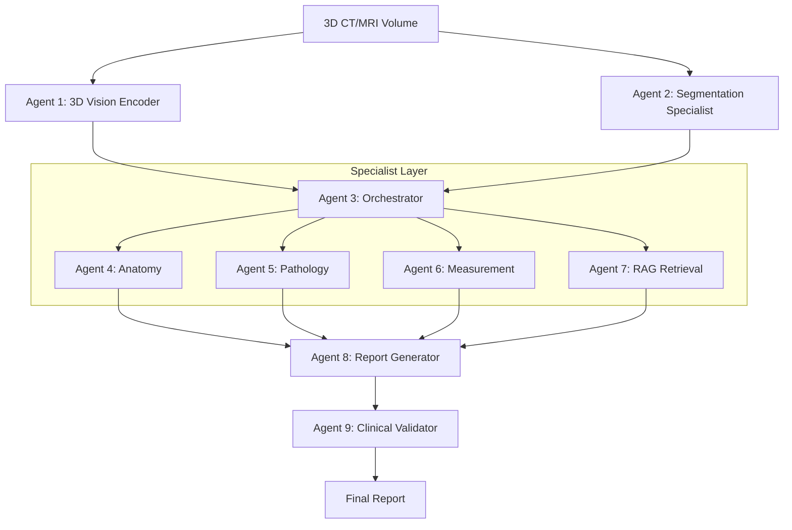

# 🚀 Agentic Multi-Modal Foundation System (AMMFS)

**Hệ Thống Tiên Tiến Tạo Báo Cáo Y Tế Tự Động từ Dữ Liệu CT/MRI 3D Đạt Chuẩn SOTA**

Dự án này triển khai một kiến trúc **Agentic AI** (Trí tuệ nhân tạo tác tử) thế hệ mới, được thiết kế để vượt qua các giới hạn của các mô hình monolithic truyền thống. **AMMFS** kết hợp sức mạnh của 3 xu hướng đột phá nhất năm 2024-2025: **Agentic Architecture**, **3D Vision-Language Modeling**, và **Segmentation-Guided Analysis**.

---

## 🏗 Kiến Trúc Hệ Thống (System Architecture)

Hệ thống hoạt động dựa trên sự phối hợp của **9 Agents chuyên biệt**, được điều phối bởi một "bộ não" trung tâm. Thay vì một mô hình lớn làm tất cả mọi việc (dễ bị ảo giác - hallucination), chúng tôi chia nhỏ vấn đề thành các tác vụ chuyên sâu được xử lý bởi các chuyên gia.

### 🧩 Sơ đồ khối


---

## 🤖 Chi Tiết Các Agents (9 Agents)

Hệ thống được module hóa thành các thành phần độc lập, dễ dàng nâng cấp và bảo trì:

### **1. Agent 1: 3D Vision Encoder (Global Understanding)**
*   **Nhiệm vụ:** Trích xuất đặc trưng hình ảnh toàn cục (global visual features) từ dữ liệu khối (volumetric data).
*   **Công nghệ:** Sử dụng kiến trúc **Swin Transformer 3D** (tương tự RadFM/M3D-LaMed) để hiểu ngữ cảnh không gian 3 chiều.
*   **Output:** Vector đặc trưng (embeddings) kích thước 512-dim cho từng vùng không gian, giúp các agent sau "nhìn" thấy ảnh.

### **2. Agent 2: Segmentation Specialist (Local Precision)**
*   **Nhiệm vụ:** Phân đoạn chính xác các cơ quan và tổn thương (organs & lesions) ở cấp độ pixel.
*   **Công nghệ:** **nnU-Net V2** (State-of-the-Art về segment y tế) kết hợp với **SAM-Med3D** để tinh chỉnh vùng biên (boundaries) dựa trên prompt.
*   **Lợi ích:** Cung cấp thông tin định lượng chính xác (kích thước, vị trí, thể tích) mà các mô hình ngôn ngữ thường gặp khó khăn.

### **3. Agent 3: Knowledge Fusion & Orchestrator ("The Brain")**
*   **Nhiệm vụ:** Lập kế hoạch (Planning) và Điều phối (Routing). Dựa trên input sơ bộ từ Agent 1 & 2, nó quyết định cần gọi những chuyên gia nào để xử lý ca bệnh này.
*   **Công nghệ:** **LLM-based Planner** (sử dụng **Anthropic Claude** hoặc GPT-4o).
*   **Ví dụ:** Nếu phát hiện nodule ở phổi, nó sẽ gọi Agent Pathology và Measurement; nếu input bình thường, nó có thể bỏ qua các bước sâu để tiết kiệm tài nguyên.

### **4. Agent 4: Anatomy Specialist**
*   **Nhiệm vụ:** Xác định chính xác vị trí giải phẫu (ví dụ: "Thùy trên phổi phải, phân thùy sau").
*   **Công nghệ:** Fine-tuned BiomedCLIP kết hợp với Knowledge Graph giải phẫu để map tọa độ sang tên gọi y học.

### **5. Agent 5: Pathology Specialist**
*   **Nhiệm vụ:** Phân loại tổn thương (ví dụ: Nodule vs Mass, Benign vs Malignant), mô tả tính chất hình thái (spiculated, ground-glass, solid).
*   **Công nghệ:** Classifier chuyên biệt (ResNet/DenseNet 3D) huấn luyện trên tập dữ liệu RadImageNet.

### **6. Agent 6: Measurement Quantifier**
*   **Nhiệm vụ:** Tính toán kích thước, thể tích, tỷ trọng (HU) một cách tất định (deterministic).
*   **Công nghệ:** Thuật toán hình học dựa trên mask phân đoạn (Mask-based calculation), đảm bảo độ chính xác tuyệt đối và nhất quán (không phụ thuộc vào ảo giác của AI sinh tạo).

### **7. Agent 7: RAG Retrieval Specialist**
*   **Nhiệm vụ:** Tìm kiếm các hướng dẫn lâm sàng (guidelines) và các ca bệnh tương tự (similar cases) để hỗ trợ chẩn đoán.
*   **Công nghệ:** Vector Database (**ChromaDB**) chứa các guideline chuẩn (ví dụ: Fleischner Society, Lung-RADS) và cơ sở dữ liệu ca bệnh lịch sử.

### **8. Agent 8: Report Generator**
*   **Nhiệm vụ:** Tổng hợp tất cả thông tin từ các agents trên để viết báo cáo hoàn chỉnh, đúng văn phong y tế.
*   **Công nghệ:** **MedGemma-2B** được tinh chỉnh (Fine-tuned) với kỹ thuật **LoRA** trên dữ liệu báo cáo chất lượng cao.

### **9. Agent 9: Clinical Validator**
*   **Nhiệm vụ:** Kiểm tra chất lượng (Quality Control). Đối chiếu nội dung báo cáo với số liệu từ Segmentation Agent để phát hiện lỗi logic.
*   **Công nghệ:** Rule-based checks (Regular Expressions) kết hợp LLM reasoning để đảm bảo an toàn cho bệnh nhân (ví dụ: cảnh báo nếu báo cáo nói "trái" nhưng ảnh là "phải").

---

## 🛠 Hướng Dẫn Cài Đặt & Chạy Demo

### 1. Cài đặt môi trường
Yêu cầu Python 3.10+ và CUDA (khuyến nghị).

```bash
git clone https://github.com/hoangtung386/Medical_reporting_agent.git
cd Medical_reporting_agent
pip install -r requirements.txt
```

### 2. Cấu hình
Sửa file `.env` hoặc set biến môi trường cho Orchestrator (nếu dùng Claude):
```bash
export ANTHROPIC_API_KEY="your-api-key-here"
```

### 3. Chuẩn bị Dữ liệu (Da Preparation)
Dự án sử dụng dataset **AbdomenAtlas 3.0 Mini**. Do kích thước dữ liệu lớn, chúng tôi cung cấp script để tải và giải nén tự động.

**Cách 1: Sử dụng Shell Script (Khuyến nghị)**
Script này sẽ tải từng phần (chunk), giải nén vào thư mục `data/image_only` và `data/mask_only` đúng cấu trúc dự án.

```bash
# Cấp quyền thực thi (nếu chưa)
chmod +x download_data.sh

# Chạy script tải dữ liệu (Cần ~500GB bộ nhớ trống)
./download_data.sh
```

**Cách 2: Sử dụng Python (Hugging Face)**
Nếu bạn muốn dùng thư viện `datasets`:
```python
from datasets import load_dataset
# Lưu ý: Cần login bằng huggingface-cli login trước
ds = load_dataset("AbdomenAtlas/AbdomenAtlas3.0Mini")
```

### 4. Chạy thử nghiệm Logic (Functional Skeleton)
Hệ thống hiện tại đã có bộ khung chức năng hoàn chỉnh. Bạn có thể chạy demo với mock data ngay lập tức:

```bash
python3 main.py
```

---

## � Lộ Trình Phát Triển & Các Bước Cần Hoàn Thiện (Roadmap)

Chúng ta đã hoàn thành **Phase 1: Foundation Setup**. Để đưa hệ thống vào thực tế (Production), cần thực hiện các bước sau trong **Phase 2**:

### ✅ Đã hoàn thành (Phase 1)
*   [x] **Architecture Design:** Thiết kế chi tiết 9 Agents.
*   [x] **Functional Skeleton:** Xây dựng khung code Python, tích hợp thư viện (MONAI, Torch, Transformers).
*   [x] **Robustness:** Cơ chế fallback thông minh (chạy được cả khi thiếu thư viện/GPU).
*   [x] **Verification:** Kiểm thử luồng dữ liệu End-to-End thành công.

### 📝 Cần thực hiện tiếp (Next Steps - Phase 2)

#### 1. Tích hợp Trọng số Mô hình (Model Weights Integration)
*   **Agent 1 (Vision):** Tải và load pre-trained weights của **Swin Transformer 3D** (từ RadFM hoặc M3D-LaMed).
    *   *Task:* Download file `.pth` -> Update path trong `vision_encoder.py`.
*   **Agent 2 (Segmentation):** Cài đặt **nnU-Net** đầy đủ và tải weights pre-trained cho organ segmentation (ví dụ: tập Totalsegmentator).
    *   *Task:* Run `nnUNet_predict` command line wrapper hoặc python API.
*   **Agent 8 (Report Gen):** Tải checkpoint **MedGemma-2B** và LoRA adapters.
    *   *Task:* Update `model_id` trong `report_gen.py`.

#### 2. Kết nối API & Dữ liệu
*   **Agent 3 (Orchestrator):** Đăng ký API Key Claude/OpenAI và đưa vào file cấu hình.
*   **Agent 7 (RAG):** Xây dựng cơ sở dữ liệu ChromaDB thực tế.
    *   *Task:* Scrape PDF guidelines -> Chunking -> Vectorize -> Insert vào DB.

#### 3. Training & Fine-tuning (Nâng cao)
*   **Data Pipeline:** Xây dựng pipeline chuẩn bị dữ liệu CT-Report pairs từ bệnh viện.
*   **Fine-tuning:** Chạy script QLoRA để training lại Agent 8 trên dữ liệu cụ thể của bệnh viện mục tiêu.

---

**Dự án Medical Reporting Agent - 2026**
*Được thiết kế để đạt chuẩn SOTA trong y tế thông minh.*
